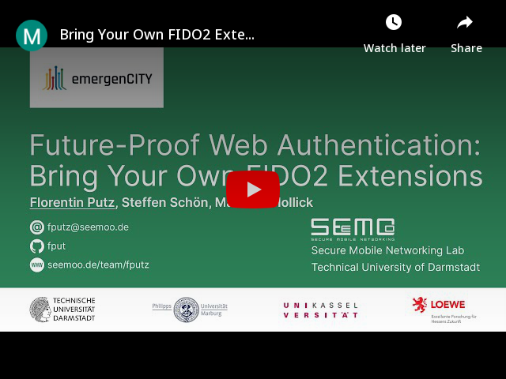
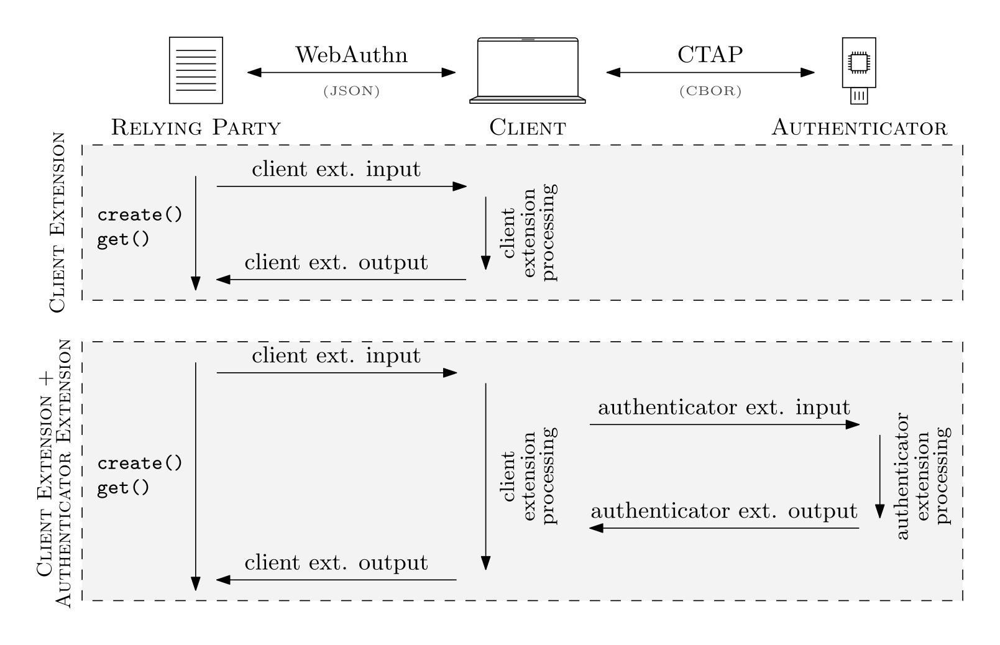
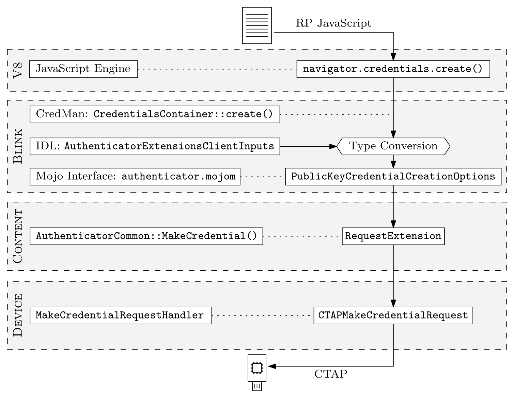

# Bring Your Own FIDO2 Extensions
This repository documents how to implement **custom FIDO2 extensions**. It contains supplementary material to [our paper at ETAA 2021](https://fputz.net/etaa21future/pdf). We describe how to implement extensions on all parts of the FIDO2 stack: On the relying party *(website)*, on the client *(browser)*, and on the authenticator *(hardware token)*.

Watch our [talk](https://www.youtube.com/watch?v=FYfluC21OoY):

[](https://www.youtube.com/watch?v=FYfluC21OoY "ETAA 2021 Talk")

Read an [overview of the paper](https://fputz.net/fido2-extensions) or the [full paper](https://fputz.net/etaa21future/pdf).

# System Model



# Design
For demonstration purposes, we design a simple FIDO2 extension: **The greeter extension**.

Specification from our paper:

> The `greeter` extension is an *authenticator extension*, which allows the authenticator to respond to the RP with a greeting message. We define an input string, which is the name of the sender (e.g., "John"). We also define an output string, which is the greeting message (e.g., "Hello John"). This extension requires no special client extension processing, as the client can simply pass through all inputs/outputs to/from the authenticator. The authenticator extension processing consists of constructing the greeting message from the input string and returning it. Our greeter extension uses the identifier `greeter` in both CTAP and WebAuthn.


# Implementations

We have implemented the greeter extension in the following components.

| Directory | Description | Comments |
| --- | --- | --- |
| [`rp-vue`](rp-vue/) | Vue.js Relying Party |  |
| [`client-chromium`](client-chromium) | Chromium Browser Client | Patch based on commit [2f9e8c90](https://chromium.googlesource.com/chromium/src/+/2f9e8c90)  |
| [`client-python`](client-python) | Python Client | Patch based on commit [c42d9628](https://github.com/Yubico/python-fido2/commit/c42d9628a4f33d20c4401096fa8d3fc466d5b77f) |
| [`authenticator-solo`](authenticator-solo) | Solo 1 Authenticator | Patch based on commit [2884f95f](https://github.com/solokeys/solo/commit/2884f95ff4d75d8934522ec49ea418a5457f8617) |

For the relying party, we provide a complete demo web app. For the rest, we povide patches that add our greeter extension to the respective projects.


## Relying Party: Vue.js Web App

Our demo web application uses the WebAuthn API and calls our greeter extension. See the [readme file](rp-vue/) in the `rp-vue` directory for more information on how to set up and run the web app. WebAuthn makes it very easy for relying parties to use FIDO2 extensions.

## Client: Chromium Browser

The [Chromium web browser](https://www.chromium.org/Home) is the base for Google Chrome and Microsoft Edge. Implementing FIDO2 extensions in Chromium is not straightforward and largely undocumented. We figured out the correct approach by inspecting the Chromium source code to see how other FIDO2 extensions are implemented. The Chromium code base is quite complex, so we need to touch many different files for this. The following figure gives an overview of the different Chromium components that are involved.




[Our patch](client-chromium/client-chromium-greeter.patch) targets Chromium commit [2f9e8c90](https://chromium.googlesource.com/chromium/src/+/2f9e8c90) for Linux and was generated using:

```bash
git diff 2f9e8c90e71af00bd400f114f436c2f09fd7b445 > client-chromium-greeter.patch 
```

Follow the [upstream instructions](https://chromium.googlesource.com/chromium/src/+/refs/heads/main/docs/linux/build_instructions.md) to get the Chromium source code at this commit and setup the development environment. Then apply our patch. During debugging, the following flags help to show more logging messages:

```bash
./out/Default/chrome –enable-logging=stderr –vmodule=“device_event_log*=1”
```


## Client: python-fido2

The [python-fido2 library](https://github.com/Yubico/python-fido2) by Yubico can be used as a FIDO2 client.

[Our patch](client-python/client-python-greeter.patch) targets python-fido2 commit [c42d9628](https://github.com/Yubico/python-fido2/commit/c42d9628a4f33d20c4401096fa8d3fc466d5b77f) and was generated using:

```bash
git diff c42d9628a4f33d20c4401096fa8d3fc466d5b77f > client-python-greeter.patch
```

See the [readme file](client-python/) in the `python-fido2` directory for more information on how to implement your own extensions.


## Authenticator: Solo

[SoloKey](https://solokeys.com/) is an open-source FIDO2 security key. Here is a [tutorial](https://github.com/solokeys/solo/blob/master/docs/tutorial-writing-extensions.md) on how to implement custom FIDO2 extensions in Solo 1.

Our implementation of the greeter extension in Solo 1 targets commit [2884f95f](https://github.com/solokeys/solo/commit/2884f95ff4d75d8934522ec49ea418a5457f8617). To try it out, clone the Solo repository, checkout this commit, and run `git submodule update --init --recursive`. You can then apply [our patch](authenticator-solo/authenticator-solo-greeter.patch), which we generated as follows:

```bash
git diff 2884f95ff4d75d8934522ec49ea418a5457f8617 > authenticator-solo-greeter.patch 
```

For debugging purposes, you can also run Solo 1 on your host as a softtoken, without hardware. If you are interested, check out the [upstream instructions](https://github.com/solokeys/solo#developing-solo-no-hardware-needed).

# Read Our Paper

We hope this project is useful for other researchers. Please cite this paper in your academic publications or in other publications which include a bibliography:

F. Putz, S. Schön, M. Hollick. [**Future-Proof Web Authentication: Bring Your Own FIDO2 Extensions**](https://fputz.net/etaa21future/pdf). In: 4th International Workshop on Emerging Technologies for Authorization and Authentication. ETAA 2021. Springer LNCS 13136, pp. 17–32, 2021. https://doi.org/10.1007/978-3-030-93747-8_2 [[Talk](https://www.youtube.com/watch?v=FYfluC21OoY)][[PDF](https://fputz.net/etaa21future/pdf)]

# License

This repository is fully open source. Our goal is to help others create their own FIDO2 extensions. All software, unless otherwise noted, is licensed under MIT. All documentation, unless otherwise noted, is licensed under CC-BY-SA 4.0.

# Contact

* [Florentin Putz](https://www.seemoo.tu-darmstadt.de/team/fputz/) \<fputz@seemoo.de\>

## Powered By

### Secure Mobile Networking Lab (SEEMOO)
<a href="https://www.seemoo.tu-darmstadt.de"></a>
### emergenCITY
<a href="https://www.emergencity.de/"></a>
### Technische Universität Darmstadt
<a href="https://www.tu-darmstadt.de/index.en.jsp"></a>
